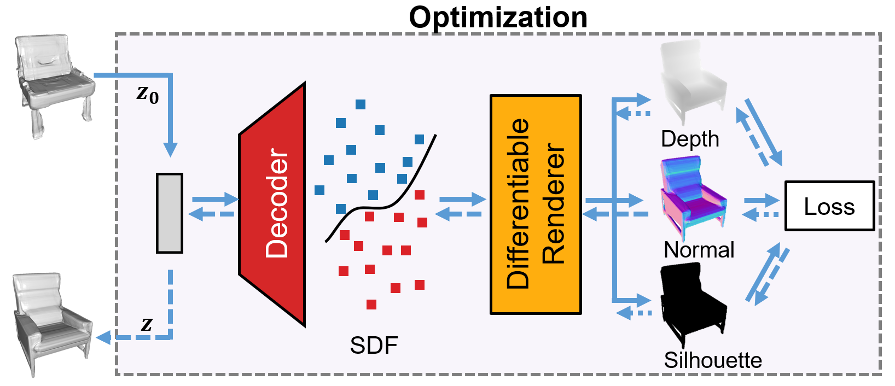

# DIST - Differentiable Sphere Tracing
[**Paper**](http://openaccess.thecvf.com/content_CVPR_2020/papers/Liu_DIST_Rendering_Deep_Implicit_Signed_Distance_Function_With_Differentiable_Sphere_CVPR_2020_paper.pdf) | [**Project Page**](http://b1ueber2y.me/projects/DIST-Renderer/) <br>



This repository contains the full implementation of the paper:

DIST: Rendering Deep Implicit Signed Distance Function with Differentiable Sphere Tracing  
[Shaohui Liu](http://b1ueber2y.me/), [Yinda Zhang](https://www.zhangyinda.com/), [Songyou Peng](http://pengsongyou.github.io/), [Boxin Shi](http://ci.idm.pku.edu.cn/), [Marc Pollefeys](https://www.inf.ethz.ch/personal/pomarc/) and [Zhaopeng Cui](https://zhpcui.github.io/)  
**CVPR 2020**  

If you find our code or paper useful, please consider citing
```
@inproceedings{liu2020dist,
 author =  {Shaohui Liu, Yinda Zhang, Songyou Peng, Boxin Shi, Marc Pollefeys, Zhaopeng Cui},
 title = {DIST: Rendering Deep Implicit Signed Distance Function with Differentiable Sphere Tracing},
 booktitle = {IEEE Conference on Computer Vision and Pattern Recognition (CVPR)},
 year = {2020}}
```
Please feel free to contact [Shaohui Liu](mailto:b1ueber2y@gmail.com) and [Songyou Peng](mailto:songyou.pp@gmail.com) for questions, comments and reporting bugs.

## Features

* [x] A structured synthesis pipeline for blender in Python.
* [x] A PyTorch implementation of DIST: a differentiable renderer over deep implicit SDF.
* [x] Interfaces for inverse optmization over single-view and multi-view inputs.
* [x] Multiple easy-to-use demos to run several different optimizations with DIST.
* [x] Demos for texture rendering over deep implicit SDF.
* [x] A speedup version implementation for converting deep implicit SDF to point clouds.
* [x] Some pretrained models for DeepSDF and implicit texturing.

## Installation
Download and install anaconda3.
```
wget https://repo.anaconda.com/archive/Anaconda3-2019.07-Linux-x86_64.sh
sh Anaconda3-2019.07-Linux-x86_64.sh
```
Initialize a virtual environment with conda.
```
conda create -n sdfrenderer python=3.7 -y
conda activate sdfrenderer
conda install pytorch=1.1.0 torchvision cudatoolkit=9.0 -c pytorch -y
```
Then, install the required packages.
```
sudo apt-get install openexr libopenexr-dev
sh install.sh
```
## Download
You can download the train/test splits of [DeepSDF](https://github.com/facebookresearch/DeepSDF) and our pretrained models.
```
cd deepsdf && sh init.sh && cd ..
```
To quickly download all the demo data and models, run:
```
bash download_all.sh
```
## Run Demo
### Single-view inverse optimization over shape code
Run the script to get the data for single-view demo:
```
bash download_scripts/download_demo_singleview_syn.sh
```
Before running single-view demo scripts, you need to first sample groundtruth and normalization parameters on ShapeNet for evaluation and calibration. Specifically, you need to follow the README of [DeepSDF](https://github.com/facebookresearch/DeepSDF) to complete the surface (use `--surface` as below) sampling process for sofa category. (Find it complex? first try out the multi-view demo for fun)
```
git clone --recursive https://github.com/facebookresearch/DeepSDF
python preprocess_data.py --data_dir data --source [...]/ShapeNetCore.v2/ --name ShapeNetV2 --split examples/splits/sv2_sofas_test.json --surface --skip
```
Then, put the resulting folders `NormalizationParameters` and `SurfaceSamples` into `data` folder. Now you can run:
```
python run_single_shape.py --visualize
```
This script should create a folder `vis/demo_singleview_shape` where the output meshes and visualizations are stored.

### Single-view inverse optimization over camera parameters
This demo uses the same data as single-view inverse optimization over shape code. Please run:
```
python run_single_camera.py --visualize
```
This script should create a folder `vis/demo_singleview_camera` where the output meshes and visualiations are stored. Generally the right camera extrinsic parameters can be acquired after optimization. However, sometimes it takes longer iteration when initialization is far away from the target.

### Multi-view 3D reconstruction on synthetic data
Run the script to get the data for demo on multi-view synthetic data:
```
bash download_scripts/download_demo_multiview_syn.sh
```
Now you can directly run:
```
python run_multi_pmodata.py --data_path data/demo_multiview_syn/ --visualize
```
This script should create a folder `vis/demo_multiview_syn/cars/` where the output meshes and visualizations are stored.

**Evaluation**: To evaluate our method on entire PMO multi-view synthetic dataset, first download their data following the original [PMO repository](https://github.com/chenhsuanlin/photometric-mesh-optim#dataset). Please cite their paper if you use the data. Put the downloaded data into the `data/multiview_syn` folder. Note that this folder should have the same data structure as `data/demo_multiview_syn/`. 
```
python run_multi_pmodata.py --data_path data/multiview_syn/ --visualize --full
```

### Multi-view 3D reconstruction on real data
Run the script to get the demo data:
```
bash download_scripts/download_demo_multiview_real.sh
```
**Note**: the original data belongs to [this paper](https://arxiv.org/abs/1602.02481). Thanks the authors of [PMO](https://arxiv.org/abs/1903.08642) for providing the intrinsic, extrinsic and the initial similarity transformation matrices. Please cite their papers if you use the data.

Once having the data, run:
```
python run_multi_realdata.py --data_path data/demo_multiview_real/ --visualize
```
In this demo with real data, we optimize over not only the shape code, but also the similarity transformation matrix. If you don't acquire satisfatory results, re-run the code (different randomly initial shape code), enlarge `num_epoch`, or tune other parameters like `sep_dist` and `refine_sim`.

### Texture rendering
We provide several scripts and texturing models for reproducing the texture rendering demos. The implementations are stored in the `demo` folder. You can directly run the demo from the root directory of this project (after models are downloaded). For example:
```
python demo/demo_lighting.py
```
The visualization results will be stored in `vis/demo_lighting`.

## More Qualitative Results
Please refer to our project page for more qualitative visualizations.

## Youtube Demo (click on the image preview)
[](https://www.youtube.com/watch?v=A6-W55VZeK0)

## Further Information
Check out some interesting concurrent works also appearing in **CVPR 2020** on bridging the gap between 2D observations and 3D implicit functions.
- [Zakharov et. al. - Autolabeling 3D Objects with Differentiable Rendering of SDF Shape Priors](https://arxiv.org/abs/1911.11288)
- [Niemeyer et. al. - Differentiable Volumetric Rendering: Learning Implicit 3D Representations without 3D Supervision](https://arxiv.org/abs/1912.07372)
- [Jiang et. al. - SDFDiff: Differentiable Rendering of Signed Distance Fields for 3D Shape Optimization](https://arxiv.org/abs/1912.07109)
- [Li et. al. - FroDO: From Detections to 3D Objects](https://arxiv.org/abs/2005.05125)

